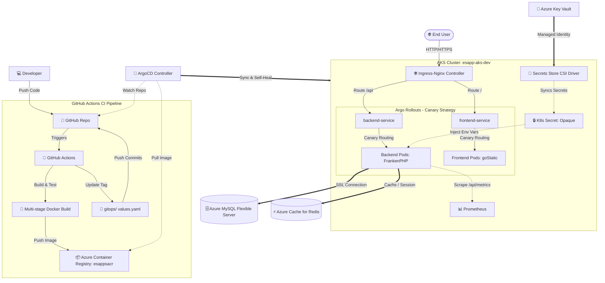

# 🛒 Cloud-Native Samsung E-Commerce Platform (Do-An-IS402)

A production-grade, highly-available full-stack E-Commerce platform built with **Laravel** (Backend API), **React** (Vite Frontend), and fully orchestrated with modern **DevOps & GitOps** best practices. The infrastructure is provisioned on **Azure** via **Terraform (IaC)**, deployed dynamically via **ArgoCD (GitOps)** on **Azure Kubernetes Service (AKS)**, and managed with **Argo Rollouts** for progressive canary delivery.

---

## 🏗️ System & GitOps Architecture



---

## ✨ Key DevOps & GitOps Features

*   **Infrastructure as Code (IaC):** Complete Azure infrastructure (VNet, Subnets, ACR, AKS, Key Vault, MySQL, Redis, Log Analytics) provisioned declaratively via [Terraform](file:///d:/Documents/Do-An-IS402/terraform).
*   **GitOps Continuous Delivery:** Full automation using **ArgoCD** following the **App-of-Apps** pattern. The cluster self-heals and synchronizes state automatically with the [gitops](file:///d:/Documents/Do-An-IS402/gitops) directory.
*   **Progressive Delivery (Canary Deployments):** Safe rollouts of new versions using **Argo Rollouts** for both backend and frontend applications (20% -> 50% -> 100% traffic steps) preventing downtime.
*   **Zero-Trust Secret Management:** Avoids storing secrets in Git. Secrets are fetched securely from **Azure Key Vault** using **Secrets Store CSI Driver** and injected directly into pods using User-Assigned Managed Identities.
*   **High Performance PHP Server:** Uses [FrankenPHP](file:///d:/Documents/Do-An-IS402/is-web-project/Dockerfile) (built on Caddy) as the Laravel application server, delivering superior speed, built-in OPcache, and HTTP/3 support.
*   **Observability:** Integrated **Prometheus** configuration scraping application metrics directly from the `/api/metrics` endpoint for real-time monitoring and alerting.

---

## 📁 Repository Structure

```text
Do-An-IS402/
├── .github/workflows/          # CI Pipelines (Backend & Frontend)
│   ├── ci-esapp.yaml           # Backend testing, build & update tag
│   └── ci-esappfe.yaml         # Frontend build, push & update tag
├── docker/                     # Local environment configs
├── gitops/                     # GitOps resources managed by ArgoCD
│   ├── applications/           # ArgoCD Application manifests (App-of-Apps)
│   ├── esapp/                  # Helm Chart for Backend (FrankenPHP + CSI secrets)
│   ├── esappfe/                # Helm Chart for Frontend (gostatic)
│   └── rollout/                # Argo Rollouts custom resource definitions
├── electronic-e-commerce/      # React + Vite Frontend
│   └── Dockerfile              # Multi-stage production build (goStatic target)
├── is-web-project/             # Laravel Backend API
│   └── Dockerfile              # Multi-stage FrankenPHP & testing Dockerfile
├── terraform/                  # Infrastructure as Code (Azure modules)
│   ├── main.tf                 # Global configuration
│   ├── aks.tf                  # Kubernetes service provisioning
│   ├── keyvault.tf             # Key Vault configuration
│   ├── mysql.tf                # Database flexible server configuration
│   └── redis.tf                # Cache storage configuration
├── docker-compose.yml          # Unified local multi-container orchestra
├── prometheus.yml              # Local monitoring scraping endpoints
└── RUNBOOK_DEV_COST_CONTROL.md # Operations manual for dev cloud resources
```

---

## 💻 Local Quick Start

Run the entire application stack locally using Docker Compose, mirroring production connections:

### 1. Prerequisites
*   [Docker Desktop](https://www.docker.com/products/docker-desktop/) installed and running.
*   Git client.

### 2. Configure Environment Files
Clone the repository and copy the environment template files:
```bash
# Set up Laravel backend .env
cp is-web-project/.env.example is-web-project/.env

# Set up global credentials
cp .secrets.local.env.example .env
```
*(Make sure to update `.env` with a secure database password, app keys, and your Google OAuth Credentials if needed).*

### 3. Spin Up Local Services
Start all containers in detached mode:
```bash
docker-compose up -d
```

### 4. Initialize Database & Backend
Execute configuration commands inside the containers:
```bash
# Install PHP Composer dependencies
docker-compose exec backend composer install

# Generate application secret keys
docker-compose exec backend php artisan jwt:secret
docker-compose exec backend php artisan key:generate

# Execute database migrations
docker-compose exec backend php artisan migrate

# Import default Samsung store demo SQL seed
docker-compose exec db bash -c "mysql -uroot -p\${MYSQL_ROOT_PASSWORD} esapp < /docker-entrypoint-initdb.d/esapp.sql"
```

### 5. Access Endpoints Locally
*   **React Frontend:** [http://localhost:5173](http://localhost:5173)
*   **Laravel API:** [http://localhost:8000/api](http://localhost:8000/api)
*   **MySQL Server:** `localhost:3307` (root / your-db-password)
*   **Redis Cache:** `localhost:6379`

---

## 🛠️ Infrastructure Provisioning (Terraform)

Infrastructure is managed under Azure. Follow these steps to provision or update the cloud components:

1.  Initialize and validate the Terraform workspace:
    ```bash
    cd terraform
    cp terraform.tfvars.example terraform.tfvars
    # Update variables in terraform.tfvars with real resource secrets
    terraform init
    terraform validate
    ```
2.  Preview changes and deploy:
    ```bash
    terraform plan -lock=false -out=tfplan
    terraform apply tfplan
    ```
3.  Load Kubernetes contexts using Azure CLI:
    ```bash
    az aks get-credentials --resource-group esapp-rg --name esapp-aks-dev
    ```

---

## 🐙 CI/CD & GitOps Flow

### 1. Continuous Integration (GitHub Actions)
The CI flows ([ci-esapp.yaml](file:///.github/workflows/ci-esapp.yaml) & [ci-esappfe.yaml](file:///.github/workflows/ci-esappfe.yaml)) automate the following tasks:
*   Triggers automatically on code modifications inside folder boundaries (`is-web-project/**` or `electronic-e-commerce/**`).
*   Runs Quality Gate steps inside dedicated test containers (`target: tester`).
*   Logs into Azure Container Registry (`az acr login`) via secure Azure OIDC integration.
*   Builds production container images and pushes them tagged with the commit SHA: `esappsacr.azurecr.io/esapp-backend:<commit_sha>`.
*   Updates the image tag value dynamically in the GitOps Helm manifests (`gitops/esapp/values.yaml` or `gitops/esappfe/values.yaml`), and commits it back to the branch.

### 2. Continuous Delivery (ArgoCD & Argo Rollouts)
*   **App of Apps:** ArgoCD watches the `/gitops/applications` path via the [app-root-manager.yaml](file:///d:/Documents/Do-An-IS402/gitops/applications/app-root-manager.yaml). Any resource declared there is deployed automatically.
*   **Auto Sync:** Once GHA commits the new image tag to Git, ArgoCD detects the change and triggers a deployment synchronization.
*   **Canary Rollout Strategy:** The deployment doesn't replace old pods immediately. **Argo Rollouts** routes 20% of traffic to the new version, pauses for validation, promotes to 50% for further inspection, and finally scales to 100% to ensure high stability.

---

## 🛑 Cost Control & Resource Management

To avoid high cloud expenses during inactive hours, follow the instructions in the [Dev Cost Control Runbook](file:///d:/Documents/Do-An-IS402/RUNBOOK_DEV_COST_CONTROL.md) to suspend and resume the dev resources safely:

*   **Stop Dev Environment:**
    ```bash
    # Stop AKS nodes
    az aks stop --resource-group rg-esapp --name esapp-aks-dev
    # Stop Database server
    az mysql flexible-server stop --resource-group rg-esapp --name esapp-mysql-dev
    ```
*   **Start & Resume Dev Environment:**
    ```bash
    # Start database and AKS
    az mysql flexible-server start --resource-group rg-esapp --name esapp-mysql-dev
    az aks start --resource-group rg-esapp --name esapp-aks-dev
    ```
    *(Remember to update public URLs and Google Callback URIs if the ingress controller public IP shifts after AKS node restarts).*

---

## 👥 Project Team

Developed for the **Cloud Computing (IS402)** course.

**University of Information Technology (UIT) - VNU-HCM**
